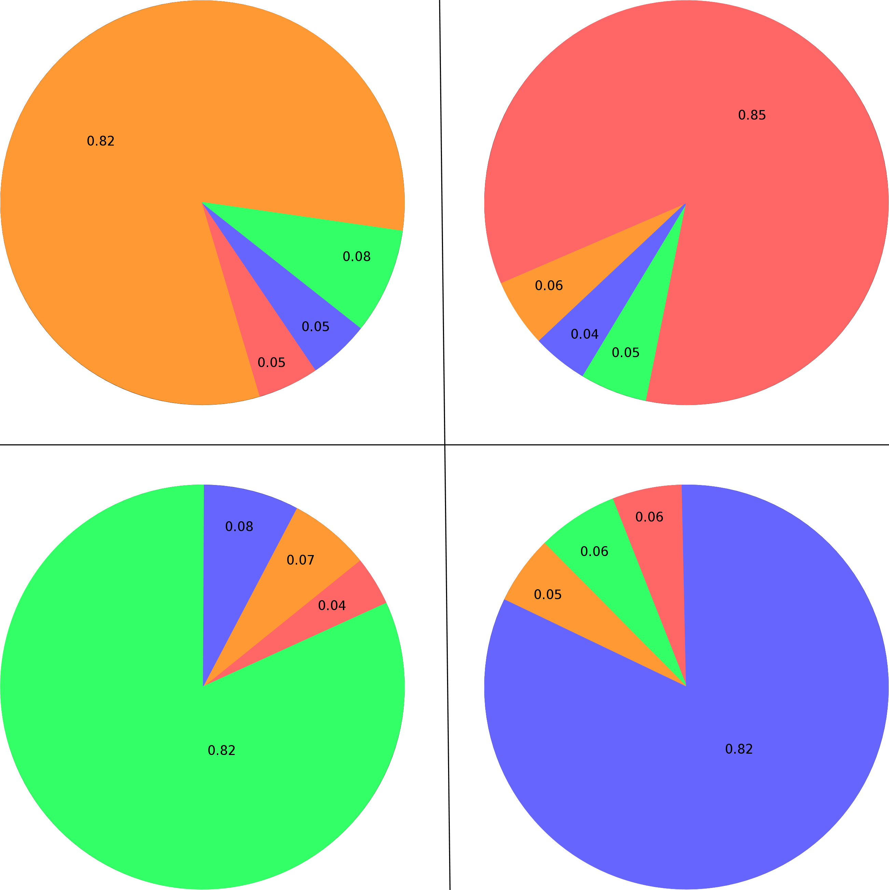

.. |pipeline| image:: https://gitlab.lis-lab.fr/dev/multiview_generator/badges/master/pipeline.svg
    :alt: Pipeline status

.. |license| image:: https://img.shields.io/badge/License-BSD%203--Clause-blue.svg
    :target: https://opensource.org/licenses/BSD-3-Clause
    :alt: License: New BSD

.. |coverage| image:: https://gitlab.lis-lab.fr/dev/multiview_generator/badges/master/coverage.svg
    :target: http://dev.pages.lis-lab.fr/multiview_generator/coverage/index.html
    :alt: Coverage

|pipeline| |license| |coverage|

Multiview Generator
===================

This package aims at generating customized mutliview datasets to facilitate the
development of new multiview algorithms and their testing on simulated data
representing specific tasks.

Understanding the concept
-------------------------

The main idea of the generator is to build several monoview sub-problems that

Structure
---------
The class of intereset is located in ``generator/multiple_sub_problems.py`` and called ``MultiViewSubProblemsGenerator``.

A demo is available in ``demo/demo.py`` and generates a 3D dataset, along with a figure that analyzes it.